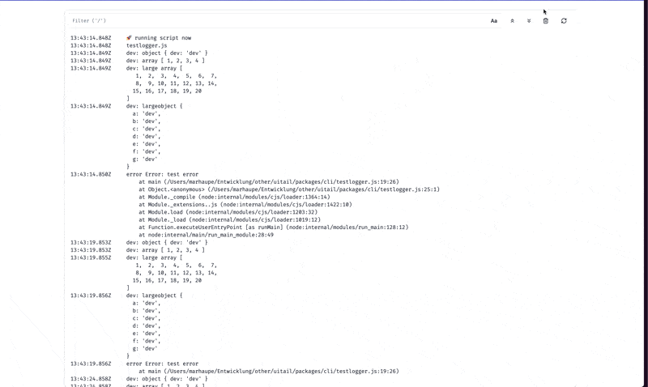

# uitail

[](https://www.repostatus.org/#active)
[](http://makeapullrequest.com)

> uitail is like `tail -f` but with a beautiful UI.

If you are like me and like debugging by printing things to the console, then you probably have struggled by finding the logs you want to see in the sea of text. If you're unlucky, your terminal might even truncate the logs at some point. Of course you could work around this by piping the logs to other command line programs, but what's the fun in that?

uitail solves this problem by providing a beautiful UI to interact with your logs. Keyboard navigation is baked in, so you can focus on actually debugging efficiently.



## Installation

### Homebrew

```bash
brew tap marhaupe/uitail https://github.com/marhaupe/uitail

brew install uitail
```

### Manually

Grab the latest release [binaries](https://github.com/marhaupe/uitail/releases).

## Usage

> uitail "make dev" [options]

Running uitail will start an agent on port `:8765`. You can access the UI on `http://localhost:8765`.

Most shortcuts are documented in the UI, apart from these:

- `j` / `k`: Navigate between logs.
- `l` / `Enter`: Open a log in more detail.

### Options

> -p, --port number: Port to run the agent on (default: 8765)

### Caveats

Log entries larger than the pipe buffer size of your system will cause individual logs to be split into chunks. This is a limitation of the underlying system and not specific to uitail itself. There will be ways to work around this, but as of now, you'll have to be aware of this, especially if you're filtering out messages.
